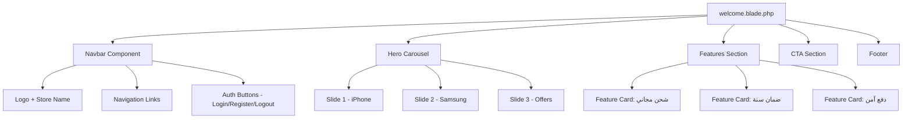

# وثيقة التصميم: صفحة الترحيب لمتجر الهواتف (phone-store-welcome-page)

## نظرة عامة

تحويل صفحة `welcome.blade.php` الحالية إلى واجهة متجر هواتف احترافية وجذابة باستخدام Bootstrap 4 وتصميم عصري يدعم RTL للنصوص العربية. تتضمن الصفحة navbar أنيق في الأعلى، وcarousel كبير لعرض الهواتف، وقسم مميزات، وfooter.

---

## المعمارية العامة



---

## تصميم المكونات والواجهات

### 1. Navbar الاحترافي

**الغرض**: شريط التنقل العلوي الثابت (sticky) مع تأثير شفافية عند التمرير

**التصميم البصري**:
- خلفية داكنة `#1a1a2e` مع تدرج لوني
- لوغو + اسم المتجر على اليسار (أو اليمين في RTL)
- روابط التنقل في المنتصف
- أزرار Auth على اليمين

**الهيكل**:
```html
<nav class="navbar navbar-expand-lg navbar-dark store-navbar fixed-top">
  <!-- Brand/Logo -->
  <a class="navbar-brand" href="/">
    <i class="fas fa-mobile-alt"></i> PhoneStore
  </a>

  <!-- Toggler for mobile -->
  <button class="navbar-toggler" ...>

  <!-- Nav Links -->
  <div class="collapse navbar-collapse">
    <ul class="navbar-nav mr-auto">
      <li><a href="/">الرئيسية</a></li>
      <li><a href="/posts">عروض الهواتف</a></li>
    </ul>

    <!-- Auth Section -->
    @auth
      <span>مرحباً، {{ Auth::user()->name }}</span>
      <a href="/logout">تسجيل الخروج</a>
    @else
      <a href="/login">تسجيل الدخول</a>
      <a href="/register">إنشاء حساب</a>
    @endauth
  </div>
</nav>
```

---

### 2. Hero Carousel

**الغرض**: عرض صور الهواتف مع نصوص ترويجية جذابة

**التصميم البصري**:
- ارتفاع `100vh` أو `600px` كحد أدنى
- تدرج لوني فوق الصورة لإظهار النص بوضوح
- نص ترويجي كبير في المنتصف
- زر CTA (اكتشف العروض)
- مؤشرات (dots) في الأسفل
- أسهم التنقل على الجانبين

**الهيكل**:
```html
<div id="phoneCarousel" class="carousel slide hero-carousel" data-ride="carousel">
  <!-- Indicators -->
  <ol class="carousel-indicators"> ... </ol>

  <!-- Slides -->
  <div class="carousel-inner">
    <div class="carousel-item active">
      <!-- Gradient overlay + text + image -->
      <div class="carousel-caption-custom">
        <h1>أحدث الهواتف الذكية</h1>
        <p>اكتشف مجموعتنا المميزة</p>
        <a href="/posts" class="btn btn-primary btn-lg">تسوق الآن</a>
      </div>
    </div>
  </div>

  <!-- Controls -->
  <a class="carousel-control-prev" ...>
  <a class="carousel-control-next" ...>
</div>
```

---

### 3. قسم المميزات (Features Section)

**الغرض**: إبراز مزايا المتجر بعد الـ Carousel مباشرة

**التصميم**:
- 3 بطاقات (cards) في صف واحد
- أيقونة + عنوان + وصف لكل بطاقة
- خلفية فاتحة مع ظل خفيف

```html
<section class="features-section py-5">
  <div class="container">
    <div class="row text-center">
      <div class="col-md-4">
        <div class="feature-card">
          <i class="fas fa-shipping-fast fa-3x"></i>
          <h4>شحن مجاني</h4>
          <p>لجميع الطلبات فوق 500 ريال</p>
        </div>
      </div>
      <!-- ... -->
    </div>
  </div>
</section>
```

---

## نماذج البيانات

### حالة المستخدم (Auth State)

```pascal
STRUCTURE AuthState
  isAuthenticated: Boolean
  userName: String | null
  dashboardUrl: String
  logoutUrl: String
END STRUCTURE
```

### بيانات شريحة الـ Carousel

```pascal
STRUCTURE CarouselSlide
  id: Integer
  imageUrl: String
  title: String
  subtitle: String
  ctaText: String
  ctaUrl: String
  overlayColor: String  // تدرج لوني CSS
END STRUCTURE
```

---

## نظام الألوان والتصميم

| العنصر | اللون |
|--------|-------|
| Navbar خلفية | `#0f0f23` (داكن جداً) |
| Navbar نص | `#ffffff` |
| زر تسوق الآن | `#e94560` (أحمر مميز) |
| Features خلفية | `#f8f9fa` |
| Feature أيقونة | `#e94560` |
| Footer خلفية | `#0f0f23` |

**الخطوط**:
- العربية: `Cairo` من Google Fonts
- الإنجليزية: `Poppins` من Google Fonts

---

## دعم RTL

```css
body {
  direction: rtl;
  text-align: right;
  font-family: 'Cairo', sans-serif;
}

.navbar-nav {
  margin-right: auto !important;
  margin-left: 0 !important;
}
```

---

## معالجة الأخطاء

| السيناريو | الحل |
|-----------|------|
| صور الـ Carousel غير موجودة | استخدام صور placeholder من unsplash أو picsum |
| المستخدم غير مسجل | إظهار زري Login/Register |
| المستخدم مسجل | إظهار اسمه + زر Logout + رابط Dashboard |

---

## استراتيجية الاختبار

- التحقق من ظهور Navbar بشكل صحيح على الموبايل والديسكتوب
- التحقق من عمل الـ Carousel تلقائياً
- التحقق من ظهور Auth links بناءً على حالة المستخدم
- التحقق من دعم RTL على جميع العناصر

---

## التبعيات

- Bootstrap 4.x (CSS + JS)
- jQuery (مطلوب لـ Bootstrap 4)
- Font Awesome 6 (للأيقونات)
- Google Fonts: Cairo, Poppins
- Laravel Blade Auth directives (`@auth`, `@guest`)
